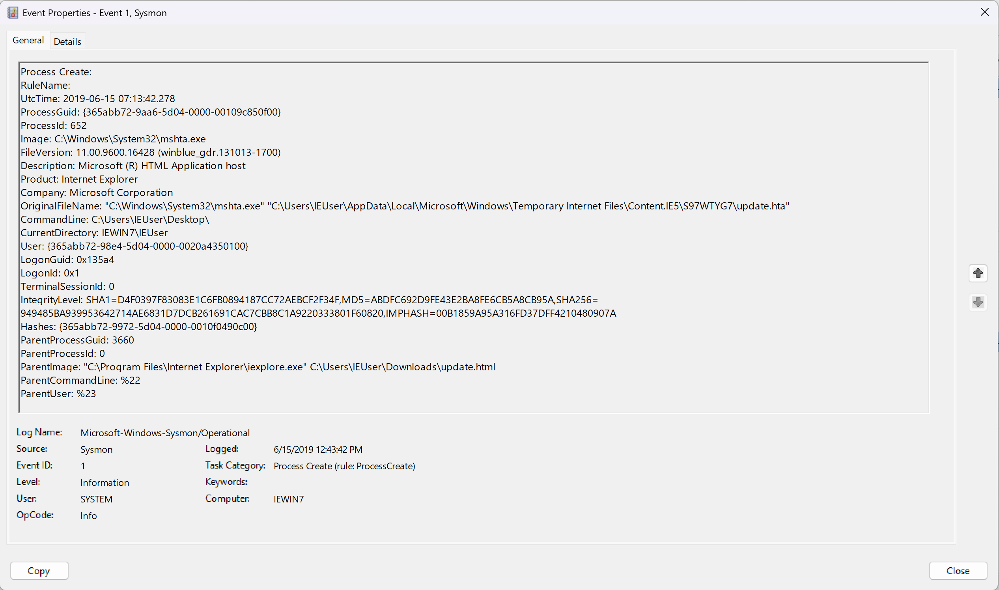
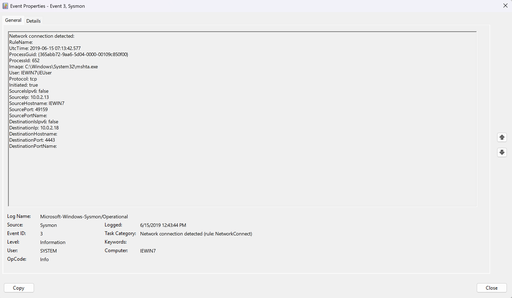
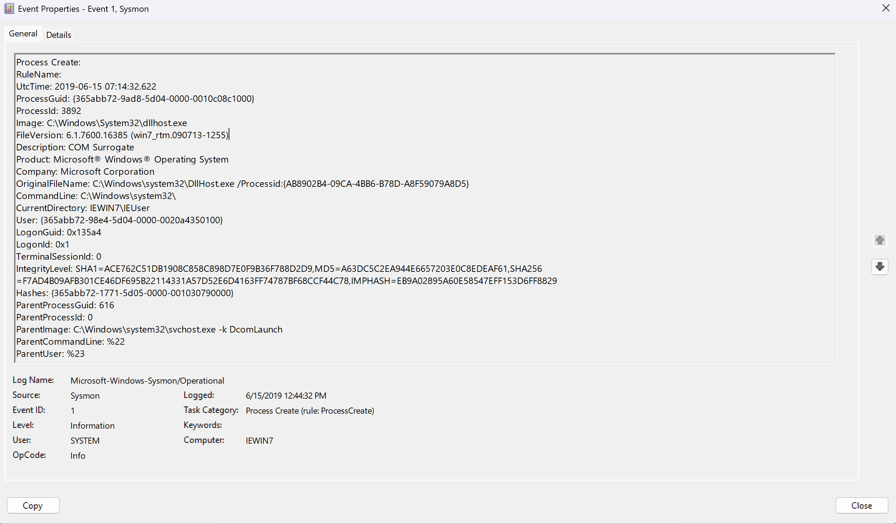

# Endpoint Investigation: mshta.exe Living-off-the-Land Execution

*Lab exercise using a publicly available Sysmon sample dataset (EVTX-ATTACK-SAMPLES) for SOC training purposes.*

## Summary
Reconstructed a 2-hop process execution chain from Sysmon logs showing Internet Explorer spawning mshta.exe to execute a cached .hta payload, followed by an outbound C2 connection. A third process (dllhost.exe) in the same log window was investigated and ruled out as unrelated via ProcessGuid verification.

## Environment
- Sample source: [sysmon_mshta_sharpshooter_stager.evtx](https://github.com/sbousseaden/EVTX-ATTACK-SAMPLES/blob/master/Execution/sysmon_mshta_sharpshooter_stager.evtx) (EVTX-ATTACK-SAMPLES, Execution folder)
- Host: IEWIN7 (lab machine)
- Tool: Windows Event Viewer

## Timeline

| Time (UTC) | Event ID | Description |
|---|---|---|
| 07:13:42.278 | 1 (Process Create) | iexplore.exe launches mshta.exe |
| 07:13:42.577 | 3 (Network Connection) | mshta.exe connects to 10.0.2.18:4443 |
| 07:14:32.622 | 1 (Process Create) | dllhost.exe created — investigated, ruled unrelated |

## Investigation Detail

**Step 1 — iexplore.exe → mshta.exe**

iexplore.exe was launched with argument `C:\Users\IEUser\Downloads\update.html`. This spawned mshta.exe with CommandLine pointing to a cached file: `...\Temporary Internet Files\Content.IE5\S97WTYG7\update.hta`. The shift from a user-visible download to a hidden browser-cache file indicates the .hta payload was silently staged by the page itself, not knowingly opened by the user.

**Step 2 — mshta.exe network connection**

ProcessGuid on this event (`{365abb72-9aa6-5d04-0000-00109c850f00}`) matches mshta.exe's ProcessGuid from Step 1, confirming mshta.exe — not another process — made the connection. `Initiated: true` confirms the host initiated the connection outbound. The connection occurred 0.3 seconds after process creation, consistent with automated payload execution rather than user-driven action.

**Step 3 — dllhost.exe ruled out**

dllhost.exe's ParentProcessGuid (`{365abb72-1771-5d05-0000-001030790000}`) was compared against mshta.exe's ProcessGuid (`{365abb72-9aa6-5d04-0000-00109c850f00}`) and found not to match. dllhost.exe's actual parent is `svchost.exe -k DcomLaunch` — the standard, expected parent for COM Surrogate processes. Excluded from the chain.

## Suspicious Indicator
iexplore.exe spawning mshta.exe is the anomalous parent-child relationship. A browser rendering a web page has no legitimate reason to hand off execution to the HTA script host — mshta.exe is a documented LOLBin technique used to execute attacker scripts via a signed Microsoft binary, often to evade basic AV.

## MITRE ATT&CK Mapping
- T1218.005 — System Binary Proxy Execution: Mshta

## Tools Used
Windows Event Viewer, Sysmon
