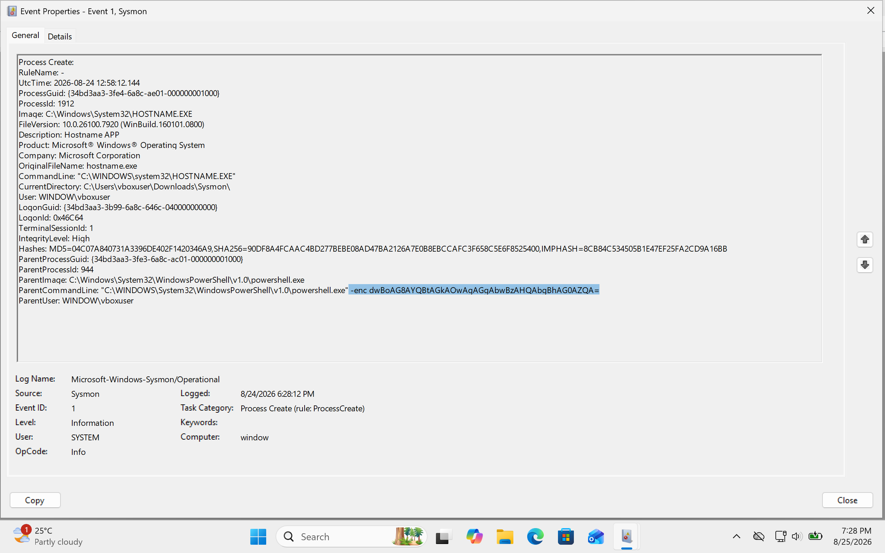
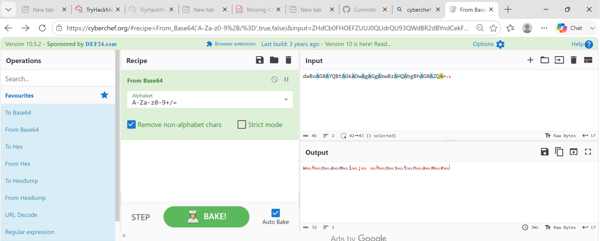
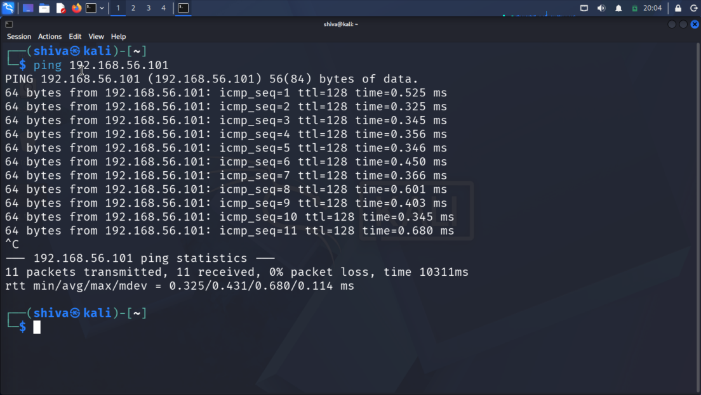
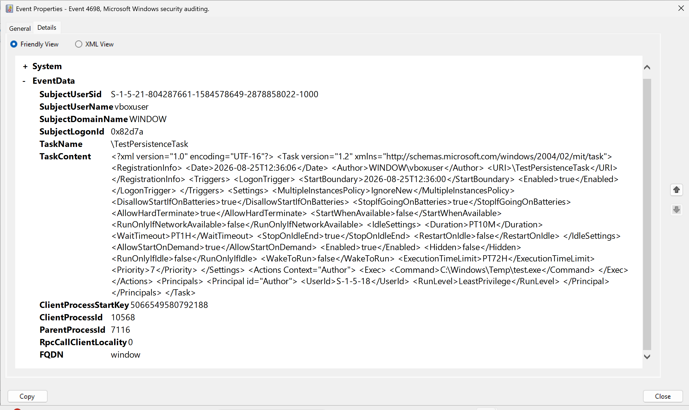
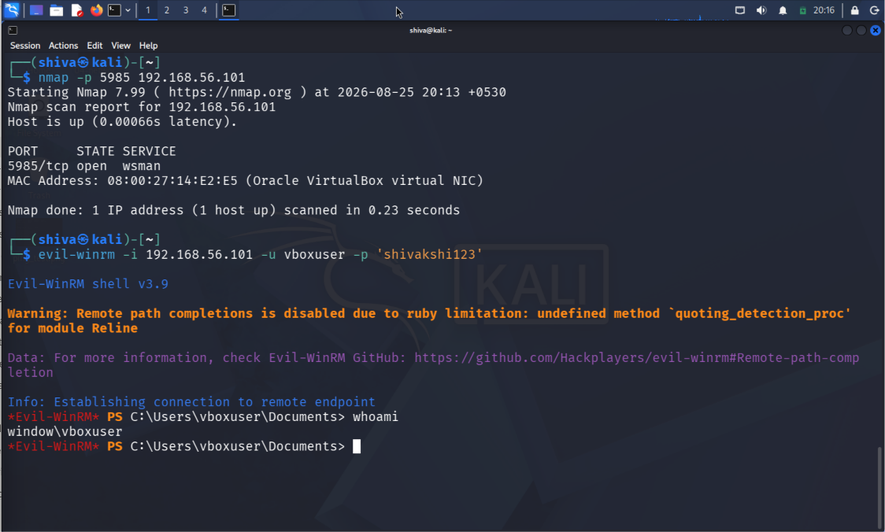
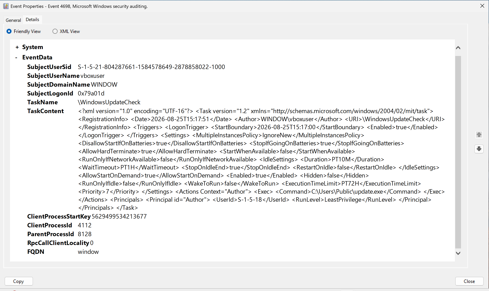

# Portfolio: Proactive Threat Hunting — Encoded PowerShell & Scheduled Task Persistence

## Overview

This exercise demonstrates proactive threat hunting methodology — searching for evidence of compromise without waiting for an alert to fire. Two hunts were conducted based on hypothesis-driven searches against Windows Sysmon and Security event logs, using a self-built two-VM lab environment (Windows 10/11 victim VM + Kali Linux attacker VM on an isolated Host-Only network).

**Tools used:** Sysmon, Windows Event Viewer, PowerShell (`Get-WinEvent`), CyberChef, evil-winrm

**Environment:** VirtualBox lab — Windows VM (`192.168.56.101`) and Kali VM (`192.168.56.103`) on a Host-Only network, isolated from any external network.

---

## Hunt #1 — Encoded PowerShell Execution

### Hypothesis
Assume an attacker is using Base64-encoded PowerShell (`-enc` / `-EncodedCommand`) to hide command execution from casual log review.

### Data Source
Sysmon Event ID 1 (Process Creation)

### Search Query
```powershell
Get-WinEvent -Path "hunt_sample.evtx" | Where-Object {
    $_.Id -eq 1 -and $_.Message -match "powershell.exe" -and $_.Message -match "-enc"
}
```

### Evidence

**Raw Sysmon Event ID 1 — encoded PowerShell command line:**



**Decoding the Base64 payload with CyberChef (`From Base64` → `Decode text`, UTF-16LE):**



### Findings

Three process creation events matched the search criteria. Each was decoded as follows:

| # | Encoded Command (truncated) | Decoded Command | Purpose |
|---|---|---|---|
| 1 | `JABzAD0ATgBlAHc...` | `Write-Host 'test payload...'; Get-Process \| Select -First 5` | Process enumeration |
| 2 | `RwBlAHQALQBDAGgA...` | `Get-ChildItem C:\Windows\System32 \| Select -First 3` | Directory enumeration (recon) |
| 3 | `dwBoAG8AYQBtAGkA...` | `whoami; hostname` | User/host identification (recon) |

**Key fields examined per event:** `ParentImage`, `Image`, `CommandLine`, `User`, `IntegrityLevel`, `Hashes`

Process lineage was confirmed: each encoded PowerShell process spawned expected child processes (e.g., `hostname.exe`) matching the decoded command content, verified via `ParentProcessGuid` linkage.

### MITRE ATT&CK Mapping
- **T1059.001** — Command and Scripting Interpreter: PowerShell
- **T1027** — Obfuscated Files or Information
- **T1082** — System Information Discovery (event #3)
- **T1083** — File and Directory Discovery (event #2)
- **T1057** — Process Discovery (event #1)

### Verdict
Confirmed test activity, self-generated for this exercise. Search logic and field analysis reflect the methodology used to detect real-world encoded PowerShell abuse.

---

## Hunt #2 — Scheduled Task Persistence (Local + Remote)

### Hypothesis
Assume an attacker created a scheduled task to establish persistence, potentially via remote access using compromised credentials.

### Data Source
Windows Security Event ID 4698 (Scheduled Task Creation)

**Setup note:** Auditing for "Other Object Access Events" is disabled by default and was manually enabled prior to this hunt:
```powershell
auditpol /set /subcategory:"Other Object Access Events" /success:enable /failure:enable
```

### Search Query
```powershell
Get-WinEvent -FilterHashtable @{LogName='Security'; Id=4698} -MaxEvents 5
```

### Lab Network Setup

A second VM (Kali Linux) was connected to the Windows VM over a VirtualBox Host-Only network to simulate an attacker operating from a separate host on the same network — not from the victim machine itself.

**Confirming VM-to-VM connectivity:**



### Scenario A — Local Task Creation (baseline)

```powershell
schtasks /create /tn "TestPersistenceTask" /tr "C:\Windows\Temp\test.exe" /sc onlogon /ru SYSTEM
```

**Resulting Event ID 4698:**



### Scenario B — Remote Task Creation via WinRM (simulated lateral access)

The Windows VM was configured with WinRM enabled (`Enable-PSRemoting`, firewall exception on port 5985). The Kali VM then connected using valid local administrator credentials via `evil-winrm`, simulating an attacker who has already obtained credentials (e.g., through phishing or credential theft — outside the scope of this exercise) and is now establishing persistence remotely:

```bash
evil-winrm -i 192.168.56.101 -u vboxuser -p '********'
```

**Remote shell established — commands now executing on the Windows VM from Kali:**



Once connected, the following command was executed **remotely, from the Kali host**:

```powershell
schtasks /create /tn "WindowsUpdateCheck" /tr "C:\Users\Public\update.exe" /sc onlogon /ru SYSTEM /f
```

**Resulting Event ID 4698, viewed from the Windows VM:**



### Findings — Key Evidence Fields

| Field | Local Task | Remote Task | Analysis |
|---|---|---|---|
| Task Action (`<Command>`) | `C:\Windows\Temp\test.exe` | `C:\Users\Public\update.exe` | Both point to world-writable, non-standard install locations |
| Trigger | `LogonTrigger` | `LogonTrigger` | Ensures re-execution on every logon — persistence indicator |
| Run-as Principal | SYSTEM (`S-1-5-18`) | SYSTEM (`S-1-5-18`) | Highest privilege level — high-value target for attackers |
| Subject Account | `vboxuser` (interactive) | `vboxuser` (via WinRM) | Same account, different access method — creation context is the key differentiator |

### Analyst Reasoning

A scheduled task is flagged as suspicious based on a combination of factors, not any single field in isolation:
1. **Location** — does the task action point outside standard install directories?
2. **Trigger** — does it guarantee automatic re-execution (logon/startup) rather than a one-time run?
3. **Privilege** — is it configured to run as SYSTEM or another elevated context?
4. **Account/context** — is task creation consistent with this account's normal behavior, and was it created locally or remotely?

### MITRE ATT&CK Mapping
- **T1053.005** — Scheduled Task/Job: Scheduled Task
- **T1021.006** — Remote Services: Windows Remote Management (Scenario B)

### Verdict
Confirmed test activity. Scenario B is notable in that it involved genuine remote code execution across a two-host lab network (not simulated on a single host), reflecting a more realistic attacker workflow: an attacker with stolen credentials abusing a legitimate Windows remote administration feature (WinRM) to establish persistence without ever touching the victim machine directly.

---

## Skills Demonstrated

- Sysmon and Windows Security event log analysis
- Hypothesis-driven (proactive) threat hunting methodology
- Base64 decoding and payload analysis (CyberChef, PowerShell)
- MITRE ATT&CK technique mapping
- Isolated multi-VM lab network configuration (VirtualBox Host-Only networking)
- Network troubleshooting (diagnosed and resolved a Windows Firewall port-filtering issue blocking WinRM on port 5985, despite ICMP/ping already working)
- Remote access/lateral movement simulation and detection (WinRM, evil-winrm)

## Repository Structure

```
04-threat-hunting/
├── README.md
└── screenshots/
    ├── 01-encoded-powershell-event.png
    ├── 02-cyberchef-decode.png
    ├── 03-4698-local-task.png
    ├── 04-network-setup-ping.png
    ├── 05-evil-winrm-session.png
    └── 06-4698-remote-task.png
```
